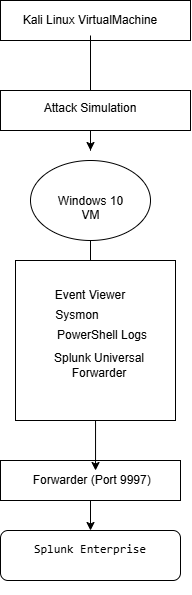
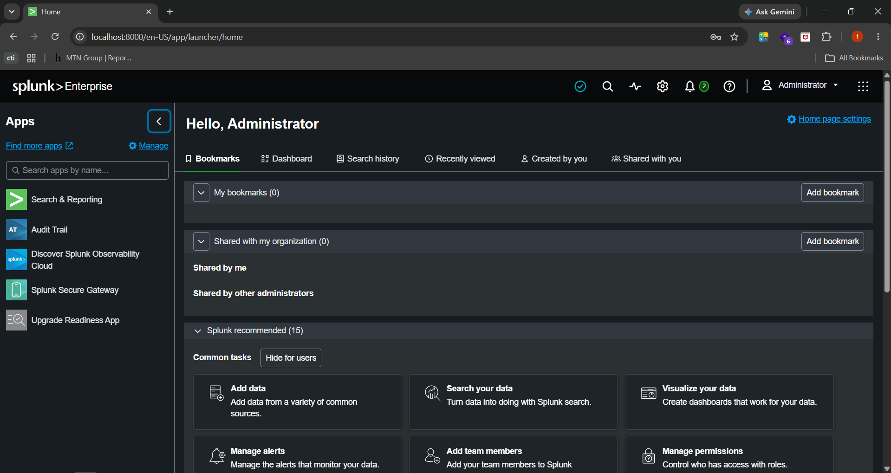
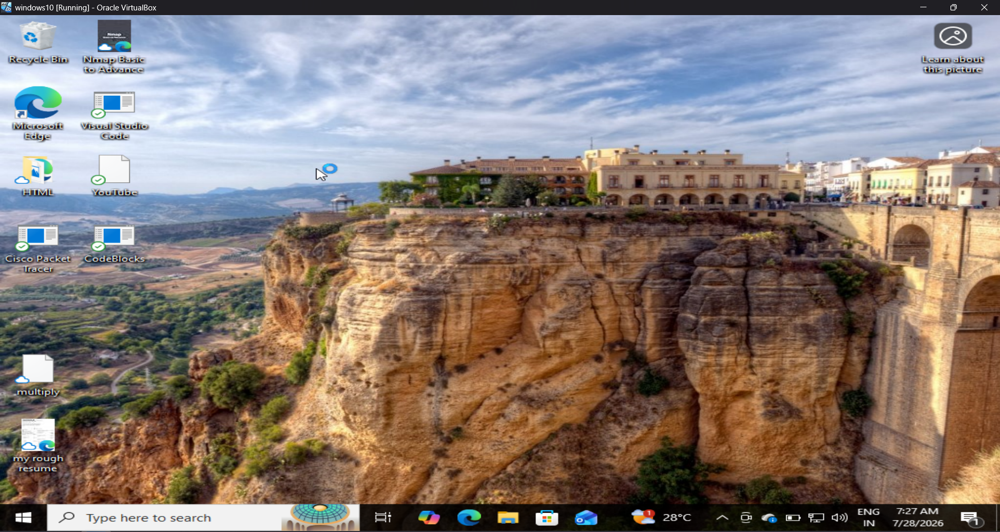
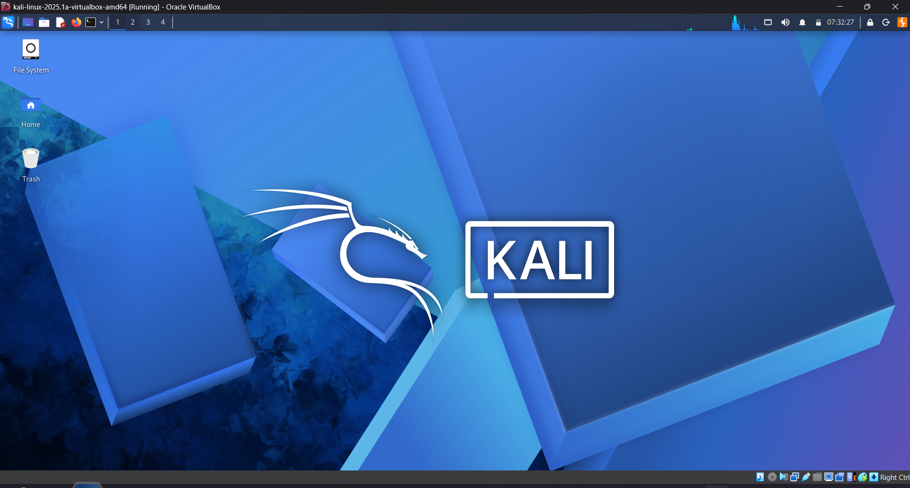
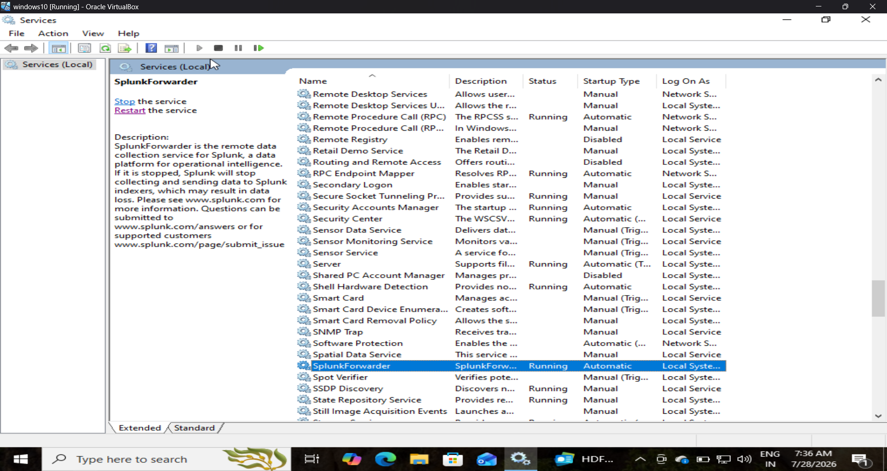

# SOC Home Lab using Splunk Enterprise

This project demonstrates the creation of a SOC Home Lab using Splunk Enterprise.

The lab collects logs from Windows and Linux systems, forwards them to Splunk, and analyzes security events generated during attack simulations.

The goal is to practice SOC Analyst Level 1 skills such as:

- Log collection
- Event investigation
- Threat detection
- Windows Event Analysis
- Sysmon Analysis
- PowerShell Logging

## Lab Architecture

## Technologies

| Tool | Purpose |
|------|---------|
| Splunk Enterprise | SIEM Platform |
| Splunk Universal Forwarder | Log Forwarding |
| Windows 10 | Log Source |
| Kali Linux | Attack Simulation |
| Sysmon | Endpoint Monitoring |
| PowerShell | Administrative Logging |

## Data Sources

| Log Source | Status |
|------------|--------|
| Security | ✅ |
| System | ✅ |
| Application | ✅ |
| Sysmon | ✅ |
| PowerShell | ✅ |
| Linux Journal | ✅ |

## Project Progress

| Task | Status |
|------|--------|
| Install Splunk Enterprise | ✅ |
| Install Universal Forwarder | ✅ |
| Configure Windows Logs | ✅ |
| Configure Sysmon | ✅ |
| Configure PowerShell Logs | ✅ |
| Configure Linux Logs | ✅ |
| Attack Simulation | ⏳ |
| Detection Rules | ⏳ |
| Dashboards | ⏳ |

## Screenshots
##Splunk installed and it's home page

##Windows in Virtual Machine

##Kali Linux in VM

##Splunk Forwarder in Windows VM

